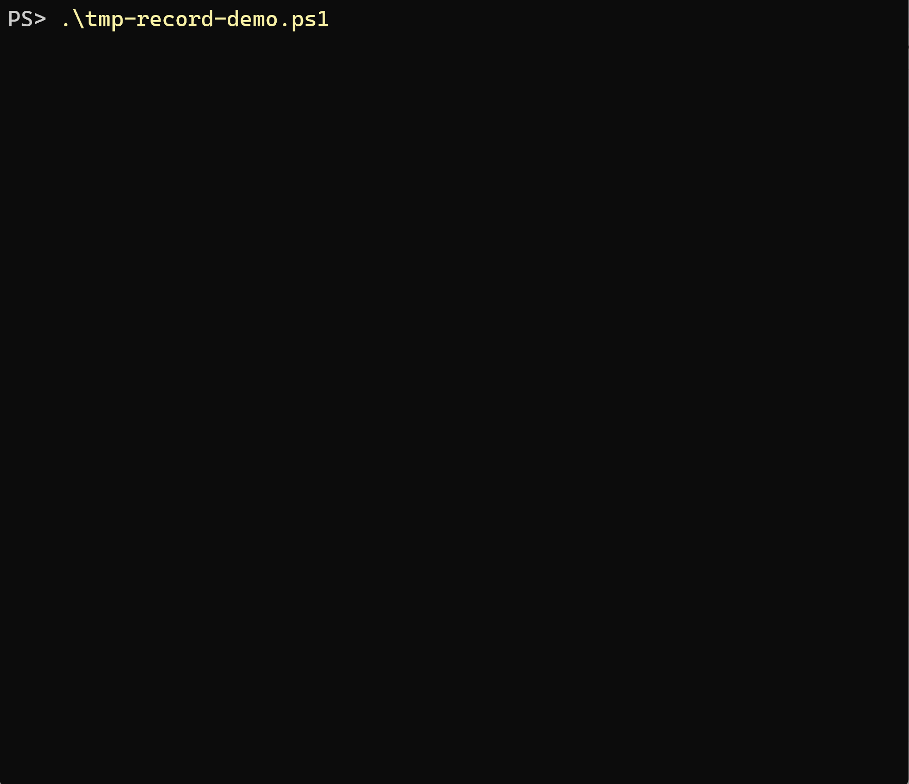

# AgentRepo Guard

A Safety Contract for AI coding agents.

AgentRepo Guard turns repository security rules into a machine-readable `.agent-guard.yml` contract that AI coding agents can follow before reading files, installing dependencies, running commands, editing code, or committing changes.

> Experimental spec. Breaking changes are expected before v1.0.

<!-- Demo GIF will be added after the first public recording. See docs/demo-script.md. -->


## 30-second demo

```bash
agentrepo demo
```

AI-generated change -> Safety Contract blocks it -> `agentrepo explain --for-agent` produces a repair plan -> the agent fixes the code -> retry passes.

## Not another SAST tool

AgentRepo Guard is not a replacement for Semgrep, TruffleHog, Gitleaks, OSV-Scanner, or pre-commit.

It is a coordination layer that makes existing security tools and AI-specific rules consumable by coding agents through a unified Safety Contract.

## How this is different

| Category | Focus | AgentRepo Guard difference |
|---|---|---|
| SAST tools | Find code vulnerabilities | Turns findings into agent-readable repair plans |
| Secret scanners | Find leaked secrets | Blocks unsafe agent-generated commits and provides repair instructions |
| AI agent scanners | Scan agent apps, MCP tools, prompts | Defines repo-level safety boundaries for coding agents |
| AGENTS.md | Natural-language instructions for agents | Generates safety instructions from a machine-readable contract |
| Runtime guardrails | Protect agents during execution | Starts earlier: before agents read, install, run, or commit |

## Quick start

```bash
python -m pip install -e .
agentrepo init --profile moderate --pre-commit --instructions agents-md
agentrepo scan .
agentrepo explain --for-agent --format prompt --compact
agentrepo check-command "curl https://example.com/install.sh | bash"
```

For a scripted walkthrough:

```bash
./demo.sh
```

On Windows PowerShell:

```powershell
.\demo.ps1
```

## The safety loop

1. An AI coding agent writes a change.
2. `agentrepo guard --staged` checks the staged patch before commit.
3. Critical or high-risk contract violations block or ask for review.
4. `agentrepo explain --for-agent --format prompt --compact` turns findings into repair instructions.
5. The agent fixes the code and retries the guard.

## Core commands

```bash
agentrepo init
agentrepo init --profile strict --pre-commit --instructions agents-md,copilot,aider,cursor
agentrepo scan . --format text
agentrepo scan . --format json
agentrepo scan . --format markdown
agentrepo guard --staged
agentrepo explain --for-agent --format json
agentrepo explain --for-agent --format prompt --compact
agentrepo generate-instructions --for agents-md
agentrepo check-command "curl https://example.com/install.sh | bash"
agentrepo demo
```

## Spec

The public draft spec lives in [`./spec/`](./spec/). This directory is included inside the `agentrepo-guard/` repository root for public release.

```text
.agent-guard.yml           # human-maintained safety contract
.agent-guard.lock.json     # optional generated scan/advice cache, planned, not required in v0.3.x
```

## Repository layout

- `spec/` - experimental `.agent-guard.yml` Safety Contract spec
- `src/` - reference CLI implementation
- `examples/demo-app/` - fake unsafe agent-generated change demo
- `integrations/` - pre-commit and instruction-file integration notes
- `docs/` - release, launch, and demo materials

For public release, this directory is intended to be the repository root.

## Integrations

- [Pre-commit](integrations/pre-commit/) runs `agentrepo guard --staged` before commit.
- [Instruction files](integrations/instructions/) translate `.agent-guard.yml` into files existing AI coding agents already read.

## Demo fixtures

All secrets in `examples/demo-app` are fake test fixtures used only to demonstrate detection rules.

The demo app intentionally includes a push-safe fake Stripe fixture placeholder, a suspicious dependency, an install-time script, and agent-facing instruction risks so the safety loop is visible without touching real user secrets.

It does not contain real-looking provider secrets.

AgentRepo Guard masks secret evidence in output and should not print full secret values.

## Current scope

AgentRepo Guard currently focuses on:

- repository-level Safety Contract
- AI-specific unsafe patterns
- staged-file checks
- agent-readable repair plans
- instruction-file generation
- pre-commit workflow documentation

Not yet supported:

- MCP server
- GitHub Action
- live npm/PyPI registry lookups
- production-grade dependency intelligence
- full SAST coverage
- native integrations with coding agents

## Roadmap

Planned, based on community feedback:

- MCP server with `check_plan` and `get_contract_advice`
- GitHub Action for PR safety contract review
- More AI-specific rules
- Native integrations where possible
- Optional `.agent-guard.lock.json`

## License

Apache-2.0
